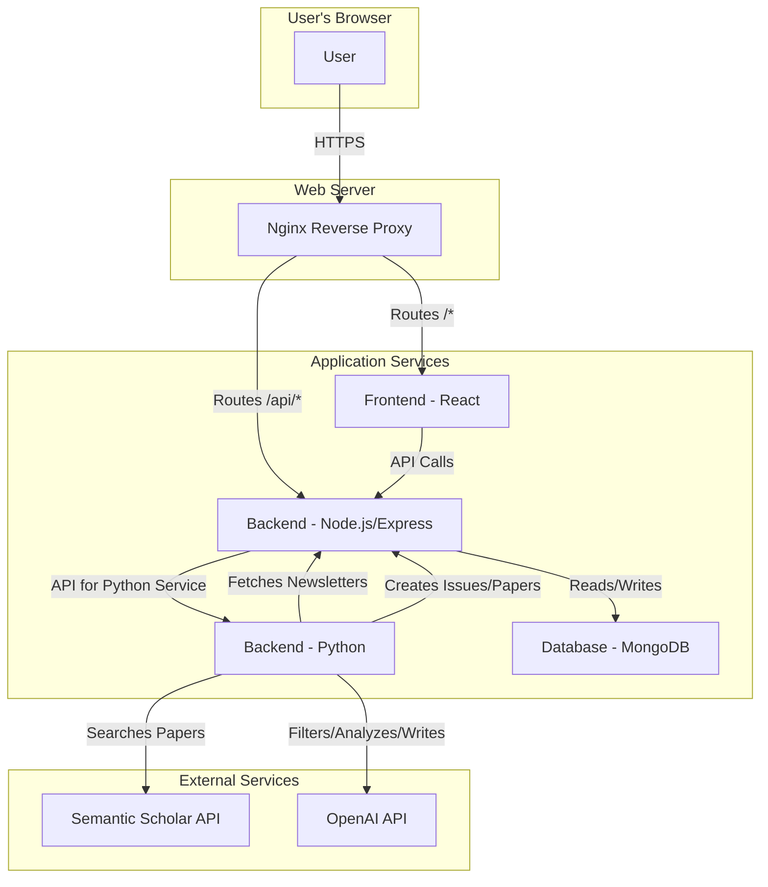

# Architecture Overview

My Research Digest is a multi-component application designed to automate the creation of research paper newsletters. The system is composed of a frontend application, a backend API, a content generation service, and a database. The entire system is containerized using Docker for portability and ease of deployment.

## System Components

The application is divided into the following services:

-   **Frontend**: A React single-page application (SPA) that provides the user interface. It is served by a Nginx server.
-   **Node.js Backend**: An Express.js application that serves as the main API for the frontend. It handles user management, newsletter and issue data, and interacts with the MongoDB database.
-   **Python Backend**: A Python script that runs as a scheduled task. It fetches data from the Node.js backend, generates new newsletter issues using the Semantic Scholar API and a large language model, and then saves the new data back to the database via the Node.js API.
-   **MongoDB**: A NoSQL database used to store all application data, including users, newsletters, and issues.
-   **Nginx**: A reverse proxy that routes incoming traffic to the appropriate service. It also handles SSL termination.
-   **Certbot**: A service for automatically renewing SSL certificates.

## Architecture Diagram

The following diagram illustrates the high-level architecture of the system:

## Request Flow

### User Interaction

1.  The user's browser loads the React frontend from the Nginx server.
2.  The frontend makes API calls to the Node.js backend (`/api/...`) for operations such as login, creating a newsletter, or viewing issues.
3.  The Node.js backend processes these requests, interacting with the MongoDB database as needed.

### Newsletter Generation (Automated)

1.  The Python backend runs on a daily schedule.
2.  It fetches the list of all newsletters from the Node.js backend.
3.  For each newsletter, it checks if a new issue needs to be generated.
4.  If a new issue is required, the Python backend:
    a.  Queries the **Semantic Scholar API** for recent papers related to the newsletter's topic.
    b.  Uses a **Large Language Model (LLM)** via the OpenAI API to filter, analyze, and synthesize the content.
    c.  Creates a new issue and its associated papers in the database by calling the Node.js backend's API.
    d.  Sends an email notification to the user.
