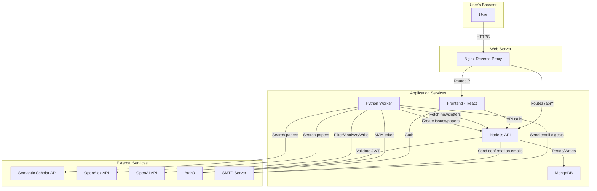

# Architecture Overview

My Research Digest is a multi-component application that automates the creation of research paper newsletters. The system is composed of a frontend, a Node.js API, a Python worker, and a database — all containerized with Docker.

## System Components

| Service | Technology | Role |
|---------|-----------|------|
| **Frontend** | React, Vite, TypeScript, shadcn/ui | User interface, served by Nginx |
| **Node.js Backend** | Express.js, MongoDB/Mongoose | Main REST API — user data, newsletters, issues, papers |
| **Python Worker** | Python, OpenAI SDK | Background job — searches papers, generates issues, sends emails |
| **MongoDB** | NoSQL database | Persistent storage for all application data |
| **Nginx** | Reverse proxy | Routes traffic, handles SSL termination |
| **Auth0** | Identity provider | JWT authentication (frontend users + Python M2M) |

## Architecture Diagram


```mermaid
graph TD
    subgraph "User's Browser"
        A[User]
    end

    subgraph "Web Server"
        B[Nginx Reverse Proxy]
    end

    subgraph "Application Services"
        C[Frontend - React]
        D[Node.js API]
        E[Python Worker]
        F[MongoDB]
    end

    subgraph "External Services"
        G[Semantic Scholar API]
        H[OpenAlex API]
        I[OpenAI API]
        J[Auth0]
        K[SMTP Server]
    end

    A -- HTTPS --> B
    B -- "Routes /api/*" --> D
    B -- "Routes /*" --> C
    C -- API calls --> D
    D -- Reads/Writes --> F
    E -- Fetch newsletters --> D
    E -- Create issues/papers --> D
    E -- Search papers --> G
    E -- Search papers --> H
    E -- Filter/Analyze/Write --> I
    E -- Send email digests --> K
    D -- Send confirmation emails --> K
    C -- Auth --> J
    E -- M2M token --> J
    D -- Validate JWT --> J
```

## Request Flow

### User Interaction

1. The browser loads the React SPA from Nginx.
2. Auth0 handles authentication; the frontend stores a JWT and passes it as a Bearer token on all API calls.
3. The Node.js backend validates the JWT via `express-oauth2-jwt-bearer` and processes the request against MongoDB.

### Newsletter Generation (Automated)

1. The Python worker runs on a 24-hour cycle.
2. For each active newsletter, it first runs an **inactivity check** — if 3+ consecutive issues went unread, it sends a warning; at 4 it disables the newsletter.
3. If the newsletter was processed within the last 7 days, it is skipped.
4. Otherwise, the worker:
   a. Generates search queries via OpenAI.
   b. Searches **Semantic Scholar** and **OpenAlex** in parallel, deduplicates results.
   c. Filters papers with an LLM.
   d. Ranks papers using the configured strategy (author-based or embedding-based).
   e. Generates per-paper synthesis and a newsletter introduction/conclusion via OpenAI.
   f. Creates the Issue and Papers in MongoDB via the Node.js API.
   g. Sends an HTML email digest with HMAC-signed "Mark as Read" and feedback links.

### Email Actions (No Login Required)

Digest emails contain HMAC-SHA256 signed URLs for two one-click actions:
- **Mark as Read**: `GET /api/public/issues/:id/mark-as-read`
- **Rate this issue**: `GET /api/public/issues/:id/feedback?rating=useful|not_useful`

Both verify the signature server-side before writing to the database, then redirect to a status page.

## Data Model

```
User ──< Newsletter ──< Issue ──< Paper
                             └─< Reading (per-user read tracking)
User ──< SavedPaper
```

Key relationships:
- `Reading` is the junction between `User` and `Issue` — used for "mark as read" and consecutive unread counting.
- `SavedPaper` persists across newsletter deletions (papers stay bookmarked even if the parent newsletter is deleted).
- `Issue.rating` stores the user's one-click feedback from the email digest.
- `Newsletter.inactivityWarningSentAt` prevents repeat warning emails during the same inactivity window.
