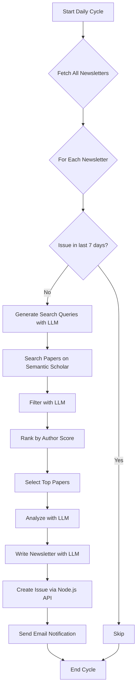

# Python Backend

The Python backend is the engine of My Research Digest. It is a standalone script that runs on a schedule (daily) to automatically generate new newsletter issues. It is not a web server; instead, it acts as a client to the Node.js backend to fetch data and post results.

## Tech Stack

-   **HTTP Client**: [requests](https://requests.readthedocs.io/en/latest/)
-   **LLM Integration**: [OpenAI Python SDK](https://github.com/openai/openai-python)
-   **Data Validation**: [Pydantic](https://docs.pydantic.dev/)
-   **LLM Provider**: [OpenAI](https://openai.com/)
-   **Scientific Paper API**: [Semantic Scholar](https://www.semanticscholar.org/product/api)

## Workflow

The Python script (`main.py`) runs in an infinite loop with a 24-hour sleep interval. In each cycle, it performs the following steps:

1.  **Fetch Newsletters**: It calls the Node.js backend to get a list of all active newsletters.
2.  **Check for Updates**: For each newsletter, it checks the publication date of the latest issue. If an issue has been published within the last 7 days, it skips to the next newsletter.
3.  **Generate Newsletter**: If a new issue is needed, it triggers the `NewsletterCreator` to generate the content.
4.  **Create Issue and Papers**: The generated content (newsletter body and paper analyses) is posted to the Node.js backend, creating a new issue and its associated paper entries in the database.
5.  **Send Notification**: An email is sent to the newsletter's creator to notify them that a new issue is available.

### Workflow Diagram



## Paper Search and Ranking Strategy

The core of the Python backend is its strategy for finding and ranking relevant research papers. This is a multi-stage process designed to balance relevance, quality, and authoritativeness.

### 1. Query Generation (LLM-based)

-   **Service**: The `generate_queries` function in `newsletter_creator.py`.
-   **Method**: Before searching, the system uses an LLM (`gpt-5-mini`) to generate three distinct search queries based on the newsletter's topic and description. This strategy creates a more robust and diverse set of search terms, increasing the chances of finding highly relevant papers that a single query might miss.

### 2. Initial Search (Broad Retrieval)

-   **Service**: The `SemanticSearch` class in `paper_search.py` is used.
-   **Source**: It queries the **Semantic Scholar API** using the multiple queries generated in the previous step.
-   **Method**: It performs a relevance search for each query, leveraging Semantic Scholar's sophisticated ranking model. The search is limited to a specific date range and retrieves a maximum of 10 papers per query (`max_papers`). It also authenticates using a **Semantic Scholar API Key** (read from the `SEMANTIC_SCHOLAR_API_KEY` environment variable) to ensure higher rate limits and more reliable access.

### 3. Relevance Filtering (LLM-based)

-   **Service**: The `filter_papers` method in `newsletter_creator.py`.
-   **Method**: The title and abstract of each paper are passed to an LLM (`gpt-5-mini`). The prompt (`paper_filterer_prompt`) is highly structured, instructing the model to act as an expert Research Screener and use strict criteria to determine if a paper is a "Must-Read." It must return a simple "yes" or "no" along with its reasoning.
-   **Outcome**: Papers that the LLM deems irrelevant are discarded. This step is crucial for refining the results and ensuring high topical alignment.

### 4. Scoring and Ranking (Author-based)

-   **Service**: The `get_paper_score` function in `newsletter_creator.py`.
-   **Metric**: The score for each *filtered* paper is calculated using the following formula:
    ```
    score = mean(author_citation_counts) * mean(author_h_indices)
    ```
-   **Rationale**: This scoring model prioritizes papers from authors who are, on average, highly cited and have a high h-index. This serves as a proxy for the paper's potential impact and the authoritativeness of the research.

### 5. Final Selection

-   The filtered papers are sorted in descending order based on their calculated score.
-   The top papers (`nb_papers`, typically 5) are selected for inclusion in the newsletter.

### 6. Analysis and Synthesis (LLM-based)

For each of the final papers, the LLM is used again (`analyze_papers`) to generate:
-   A **synthesis** of the paper's key findings.
-   An explanation of its **usefulness** to the reader.

This analysis is what gets displayed in the final newsletter issue.

## Transparency, Limitations and Future Work

-   **Transparency**: This multi-stage process is designed to be as transparent as possible. The combination of LLM-generated queries, a broad search, LLM-based filtering, and a clear, author-based ranking metric provides a balanced approach to content curation.
-   **Limitations**:
    -   The reliance on author metrics (`citationCount`, `hIndex`) can create a "rich get richer" effect, potentially overlooking high-quality work from early-career researchers.
    -   The LLM's relevance filtering and analysis are subjective and can sometimes be inconsistent.
-   **Future Work**:
    -   Incorporate paper-level metrics (e.g., citation velocity, journal impact factor) into the scoring algorithm.
    -   Allow users to customize the ranking strategy (e.g., prioritize for novelty over authoritativeness).
    -   Experiment with different LLM providers or models for the generation, filtering, and analysis steps.