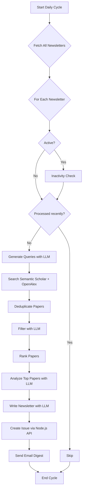

# Python Backend

The Python backend is the engine of My Research Digest. It runs as a background worker on a daily schedule to automatically generate new newsletter issues. It is not a web server; it acts as a client to the Node.js backend to fetch data and post results.

## Tech Stack

- **HTTP Client**: [requests](https://requests.readthedocs.io/en/latest/)
- **LLM Integration**: [OpenAI Python SDK](https://github.com/openai/openai-python)
- **Data Validation**: [Pydantic](https://docs.pydantic.dev/)
- **Paper Sources**: [Semantic Scholar API](https://www.semanticscholar.org/product/api), [OpenAlex API](https://openalex.org/)

## Workflow

The worker (`worker.py`) runs in an infinite loop with a 24-hour sleep interval. Each cycle:

1. **Fetch Newsletters**: Calls the Node.js backend to get all newsletters.
2. **Inactivity Check** *(active newsletters only)*: Counts consecutive unread issues from most recent. Sends a warning email at 3 and disables the newsletter at 4, to avoid generating unused content.
3. **Skip Check**: If `lastSearch` (or latest issue date) is within the last 7 days, the newsletter is skipped.
4. **Search Papers**: Queries Semantic Scholar and OpenAlex with AI-generated queries. Results are deduplicated by normalized title.
5. **Relevance Filtering**: Each paper's title and abstract are screened by an LLM.
6. **Ranking**: Papers are scored using the configured strategy (author-based or embedding-based).
7. **Analysis**: The top papers are analyzed by an LLM to produce a synthesis and a "why it matters" explanation.
8. **Write Newsletter**: An LLM generates the issue title, introduction, and conclusion.
9. **Persist**: Creates the Issue and its Papers via the Node.js API.
10. **Send Email**: Delivers the full HTML digest by SMTP, including HMAC-signed "Mark as Read" and feedback buttons.

### Workflow Diagram

```mermaid
graph TD
    A[Start Daily Cycle] --> B{Fetch All Newsletters};
    B --> C{For Each Newsletter};
    C --> D{Active?};
    D -- Yes --> E[Inactivity Check];
    D -- No --> F{Processed recently?};
    E --> F;
    F -- Yes --> G[Skip];
    F -- No --> H[Generate Queries with LLM];
    H --> I[Search Semantic Scholar + OpenAlex];
    I --> J[Deduplicate Papers];
    J --> K[Filter with LLM];
    K --> L[Rank Papers];
    L --> M[Analyze Top Papers with LLM];
    M --> N[Write Newsletter with LLM];
    N --> O[Create Issue via Node.js API];
    O --> P[Send Email Digest];
    P --> Q[End Cycle];
    G --> Q;
```

## Paper Search and Ranking Strategy

### 1. Query Generation (LLM-based)

The `generate_queries` function uses an LLM to produce multiple distinct search queries from the newsletter's topic and description. Stored queries are reused on subsequent runs; new ones are generated only when none exist.

### 2. Multi-Source Search

Two search backends, both implementing the `PaperSearch` ABC defined in `paper_search.py`:

- **`SemanticSearch`**: Queries the Semantic Scholar API. Supports filtering by venue, publication type, citation count, and open-access PDF availability.
- **`OpenAlexSearch`**: Queries the OpenAlex API. Complements Semantic Scholar with broader coverage.

Both backends normalize results to a common field schema (`config.py::FIELDS`). After merging, duplicates are removed by normalizing and comparing titles.

### 3. Relevance Filtering (LLM-based)

Each paper's title and abstract are passed to an LLM with the `paper_filterer_prompt`. The model acts as an expert screener and returns a yes/no decision. Papers that fail are discarded.

### 4. Ranking (Two Strategies)

Configurable per newsletter via the `rankingStrategy` field:

- **`author_based`** *(default)*: `log1p(citation_count) + max(author_h_indices)` — prioritizes papers from authoritative, well-cited authors.
- **`embedding_based`**: Cosine similarity between each paper's abstract embedding and the newsletter's topic description embedding (OpenAI embeddings). Prioritizes semantic closeness to the stated interest.

### 5. Analysis and Synthesis

For each selected paper, the LLM generates:
- A **synthesis** of the paper's key findings.
- A **"why it matters"** explanation for the reader.

## Inactivity Management

To avoid generating content that isn't being read:

- After **3 consecutive unread issues**, a warning email is sent to the user. The timestamp is saved in `inactivityWarningSentAt` to prevent repeat sends during the same week.
- After **4 consecutive unread issues**, the newsletter is set to `inactive` and a deactivation email is sent. Users can reactivate at any time from their dashboard.
- If the user reads an issue after a warning was sent, `inactivityWarningSentAt` is cleared and the counter resets.

## Email Actions

Digest emails include two types of HMAC-signed one-click actions (no login required):

- **Mark as Read**: Records a `Reading` entry for the user and issue.
- **Issue Feedback**: Records a `rating` (`useful` or `not_useful`) on the Issue. The rating value is included in the signature to prevent tampering.

Both redirect to a status page on the frontend after completing.

## Transparency, Limitations and Future Work

- **Transparency**: The multi-stage pipeline (query generation → dual-source search → LLM filtering → configurable ranking) is designed to be clear and auditable.
- **Limitations**:
  - Author-based ranking can disadvantage early-career researchers.
  - LLM filtering and analysis are subjective and occasionally inconsistent.
- **Future Work**:
  - Feed per-paper feedback signals (like/dislike) back into the ranking function.
  - Incorporate paper-level metrics (citation velocity, journal impact factor).
  - Support configurable digest frequency (bi-weekly, monthly) per newsletter.
